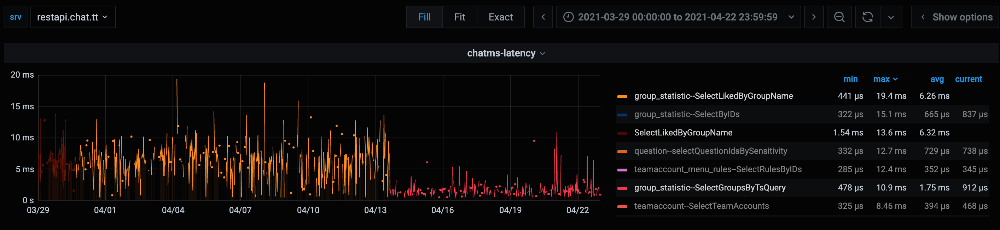

+++
author = "李雪寒"
title = "基于 PostgreSQL 的群聊搜索实践"
date = "2022-01-13"
description = "PostgreSQL 对全文搜索支持比较好，所以选择了 PostgreSQL 来实现群搜索需求。 在使用 PostgreSQL 做群搜索的过程中，也经历了由简单到复杂的迭代过程，中间也踩了不少坑。 下面的几个例子说明了方案的演进过程和我们的优化思路，希望能够对大家有所帮助。"
tags = [
"模糊搜索",
"PostgreSQL",
]
categories = [
"TECH",
]
+++

## 背景

2021年年初，探探上线了群聊功能，并且支持按照群名进行模糊搜索。

对于复杂场景的搜索，业界一般使用非常流行的 ElasticSearch。由于我们的群数据较少，截止到目前还没有达到千万级的量级，且搜索场景比较简单，而 PostgreSQL 对全文搜索又支持得比较好，所以选择了 PostgreSQL 来实现群搜索需求。
在使用 PostgreSQL 做群搜索的过程中，也经历了由简单到复杂的迭代过程，中间也踩了不少坑。 下面的几个例子说明了方案的演进过程和我们的优化思路，希望能够对大家有所帮助。


## LIKE 模糊查询

提到模糊搜索，最简单的办法就是对搜索列进行 like 匹配： 在输入词的前后加上 `%` 即可,如下所示:

```sql
SELECT * FROM groups WHERE name LIKE '%探探%';
```

这种方案可行是可行了，但是实现过于简单粗暴。对此方案进行测试：

建一张简单的表进行测试，表结构如下：

```sql
lixuehan=# \d groups;
                                   Table "public.groups"
 Column |         Type          | Collation | Nullable |              Default
--------+-----------------------+-----------+----------+------------------------------------
 id     | bigint                |           | not null | nextval('groups_id_seq'::regclass)
 name   | character varying(50) |           |          |
Indexes:
    "groups_pkey" PRIMARY KEY, btree (id)
```

表中只有两列：主键 `id` 以及群名 `name`。


```sql
create or replace function gen_hanzi(int) returns text as $$
declare
    res text;
begin
    if $1 >=1 then
        select string_agg(chr(19968+(random()*20901)::int), '') into res from generate_series(1,$1);
        return res;
    end if;
    return null;
end;
$$ language plpgsql strict;

```

`gen_hanzi` 是一个随机生成汉字的函数，我们使用一个该函数构造 100w 条数据，插入到该表中。

```
lixuehan=# insert into groups(name) select gen_hanzi(20) from generate_series(1,1000000);
INSERT 0 1000000
lixuehan=# select count(*) from groups;
 count
--------
 1000000
(1 row)
```

现在开始对上表根据 `name` 列进行 like 搜索。

```sql
SELECT * FROM groups WHERE name LIKE '%探探%';
```

查看其执行计划

```
lixuehan=# explain analyze select * from groups where name like '%探探%';
                                                       QUERY PLAN
------------------------------------------------------------------------------------------------------------------------
 Gather  (cost=1000.00..20321.24 rows=110 width=69) (actual time=0.388..116.679 rows=1 loops=1)
   Workers Planned: 2
   Workers Launched: 2
   ->  Parallel Seq Scan on groups  (cost=0.00..19310.24 rows=46 width=69) (actual time=64.666..101.982 rows=0 loops=3)
         Filter: ((name)::text ~~ '%探探%'::text)
         Rows Removed by Filter: 366671
 Planning Time: 0.182 ms
 Execution Time: 116.694 ms
```

搜索执行耗时接近 `117ms`，全表扫描，显然有优化空间。

### 建 Btree 索引

在 PostgreSQL 官方网站上看到了这样一句话：

> The optimizer can also use a B-tree index for queries involving the pattern matching operators LIKE and ~
> if the pattern is a constant and is anchored to the beginning of the string — 
> for example, col LIKE 'foo%' or col ~ '^foo', **but not col LIKE '%bar'**.

官方推荐的做法是给搜索列建立 btree 索引，但是不支持前模糊查询（为避免歧义，这里的「前模糊查询」指的是前缀不确定的查询，「后模糊查询」指的是后缀不确定的查询，后面不再赘述）。

于是，我们尝试对 `name` 列构建 `btree` 索引。

```sql
create index group_name_idx on groups using btree(name);
```

然后再对该表执行查询，分别执行前模糊、后模糊和两边均模糊三种：

```
lixuehan=# explain analyze select * from groups where name like '%探探大群%';
                                                       QUERY PLAN
-------------------------------------------------------------------------------------------------------------------------
 Gather  (cost=1000.00..20321.24 rows=110 width=127) (actual time=0.158..108.548 rows=1 loops=1)
   Workers Planned: 2
   Workers Launched: 2
   ->  Parallel Seq Scan on groups  (cost=0.00..19310.24 rows=46 width=127) (actual time=66.183..101.712 rows=0 loops=3)
         Filter: ((name)::text ~~ '%探探大群%'::text)
         Rows Removed by Filter: 366671
 Planning Time: 0.098 ms
 Execution Time: 108.756 ms
(8 rows)

lixuehan=# explain analyze select * from groups where name like '探探大群%';
                                                         QUERY PLAN
----------------------------------------------------------------------------------------------------------------------------
 Index Scan using groups_name_idx on groups  (cost=0.55..8.57 rows=110 width=127) (actual time=0.810..0.811 rows=1 loops=1)
   Index Cond: (((name)::text >= '探探大群'::text) AND ((name)::text < '探探大羥'::text))
   Filter: ((name)::text ~~ '探探大群%'::text)
 Planning Time: 1.229 ms
 Execution Time: 0.829 ms
(5 rows)

lixuehan=# explain analyze select * from groups where name like '%探探大群';
                                                       QUERY PLAN
------------------------------------------------------------------------------------------------------------------------
 Gather  (cost=1000.00..20321.24 rows=110 width=127) (actual time=0.161..104.288 rows=1 loops=1)
   Workers Planned: 2
   Workers Launched: 2
   ->  Parallel Seq Scan on groups  (cost=0.00..19310.24 rows=46 width=127) (actual time=64.530..98.686 rows=0 loops=3)
         Filter: ((name)::text ~~ '%探探大群'::text)
         Rows Removed by Filter: 366671
 Planning Time: 0.094 ms
 Execution Time: 104.315 ms
(8 rows)


```

可以看到，**只有在执行后模糊查询时**，命中索引，耗时缩短到了 `0.829ms`。

不支持前模糊查询没有关系，再建一个反向索引即可：

```sql
CREATE INDEX ON groups(reverse(name));
```
执行搜索时，执行反向查询，如下：

```sql
select * from groups where reverse(name) like reverse('%探探');
```

查看其执行计划：

```
Bitmap Heap Scan on groups  (cost=292.93..10708.01 rows=5500 width=127)
   Filter: (reverse((name)::text) ~~ '探探%'::text)
   ->  Bitmap Index Scan on groups_reverse_idx  (cost=0.00..291.55 rows=5500 width=0)
         Index Cond: ((reverse((name)::text) >= '探探'::text) AND (reverse((name)::text) < '探掣'::text))
(4 rows)
```
可以看到已经命中了 `groups_reverse_idx` 索引。

这样，在业务代码中最多执行两次，即可实现前后模糊搜索（虽然看起来比较笨，但是也勉强实现了需求）。但是接下来，遇到的问题让人感到头疼。

在执行简单测试时，发现我们的测试环境可以走索引，但是生产环境却不能！！！

在查询资料后，得知这种模糊查询命中索引的方案跟数据库的 `Locale` 设置有关系，而当时我们生产环境的设置和测试环境的 `Locale` 设置是不一样的。

可以执行下面的命令查询一个库的 `Locale` 设置。

```
lixuehan=# \l+ lixuehan
                                            List of databases
   Name   |  Owner   | Encoding | Collate | Ctype | Access privileges | Size  | Tablespace | Description
----------+----------+----------+---------+-------+-------------------+-------+------------+-------------
 lixuehan | lixuehan | UTF8     | C       | C     |                   | 28 MB | pg_default |
(1 row)
```

这里的 `Collate` 和 `Ctype` 就是跟 `Locale` 相关的两个参数，在 `Ctype` 为 `en_US.UTF-8` 时，直接对搜索列建 `Btree` 索引，无法实现预期效果。

上面我们用来举例的数据库，正好 `Ctype` 和 `Collate` 均为 `C`，是支持模糊搜索的。对于这两个参数的设置，官网有如下描述：

> Some locale categories must have their values fixed when the database is created. 
> You can use different settings for different databases, but **once a database is created, you cannot change them for that database anymore**. 
> LC_COLLATE and LC_CTYPE are these categories.

这里说的很明白，一旦数据库被创建了，就不能更改其 `LC_COLLATE` 和 `LC_CTYPE` 设置了（这两个参数分别对应上面的 `Collate` 和 `Ctype`）。

为此，再建一个 `Locale` 非 `C` 的数据库，重复上面的查询。

```sql
create database lixuehan2 LC_COLLATE 'en_US.UTF-8' LC_CTYPE 'en_US.UTF-8' TEMPLATE template0;
```

```
lixuehan2=# explain analyze select * from groups where name like '探%';
                                                      QUERY PLAN
-----------------------------------------------------------------------------------------------------------------------
 Gather  (cost=1000.00..20321.17 rows=110 width=69) (actual time=0.364..71.770 rows=59 loops=1)
   Workers Planned: 2
   Workers Launched: 2
   ->  Parallel Seq Scan on groups  (cost=0.00..19310.17 rows=46 width=69) (actual time=1.583..58.687 rows=20 loops=3)
         Filter: ((name)::text ~~ '探%'::text)
         Rows Removed by Filter: 366647
 Planning Time: 0.225 ms
 Execution Time: 71.798 ms
(8 rows)

```
可以看到，执行计划已经变为全表扫描，无法达到预期效果。

那么 `Locale` 是什么？

维基百科给出的解释：

> 区域设置（locale），也称作“本地化策略集”、“本地环境”，是表达程序用户地区方面的软件设定。不同系统、平台、与软件有不同的区域设置处理方式和不同的设置范围，但是一般区域设置最少也会包括语言和地区。操作系统的区域设置通常比较复杂。区域设置的内容包括：数据格式、货币金额格式、小数点符号、千分位符号、度量衡单位、通货符号、日期写法、日历类型、文字排序、姓名格式、地址等等。

简单来说，就是一个与区域文化相关的内容显示及解析问题。

为什么 `LC_TYPE` 为 `en_US.UTF-8` 类型的 `Locale`，不能支持中文的 like 索引？

这里摘抄 PostgreSQL 官方给出的解释：

> On all platforms, the collations named default, C, and POSIX are available. 
> Additional collations may be available depending on operating system support.
> The default collation selects the LC_COLLATE and LC_CTYPE values specified at database creation time.
> The C and POSIX collations both specify “traditional C” behavior, in which only the ASCII letters “A” through “Z” are treated as letters, and sorting is done strictly by character code byte values.

总结就是：在所有平台上，名为 `default`、`C` 和 `POSIX` 的排序规则都可用，其他的排序必须操作系统支持。数据库默认只支持 `C` 和 `POSIX` 排序，而其排序方式就是最简单的按照 `ASCII` 字母表进行排序。所以，如果将
`Locale` 设置为 `en_US.UTF-8`，底层操作系统不支持，数据库自然也不会支持按照这种编码排序了。

## GIN 索引

实际上，使用 PostgreSQL 进行模糊搜索时，除了使用 Btree 索引，还可以使用 GIN 索引。

什么是 GIN 索引呢？

GIN，全称为通用倒排索引（Generalized Inverted Index）。倒排索引也被称为反向索引，被用来存储在全文搜索下某个单词在一个文档或者一组文档中的存储位置的映射。
也就是说，知道某个词，就可以知道这个词出现在文档的哪些位置。

在 GIN 中全文搜索的基本单元就是 `document`，在 GIN 中查询一个词，即查询出现这个词的所有 `document`。为了搜索方便，`document` 会被转化成一个特殊的类型：`tsvector`。

`tsvector` 由 `lexemes`（语素） 和`lexemes` 出现在 `document` 中的位置组成。

这里出现的术语较多，举个例子就明白了：

```
postgres=# select to_tsvector('There was a crooked man, and he walked a crooked mile');

to_tsvector               
-----------------------------------------
 'crook':4,10 'man':5 'mile':11 'walk':8
(1 row)

```
上面的查询利用 PostgreSQL 自带的 `to_tsvector` 函数将一句话转换为了多个 `tsvector`。

在上面的例子中，`'crook':4,10` 为第一个 `tsvector`，第一部分为语素：crook，第二部分为出现的位置：句中的第 `4` 个和第 `10` 个单词的位置（下标从 `1` 开始），以此类推。

这里的停用词（"there", "was", "a", "and", "he"）全部被去掉（因为这些词出现的频率太高了，对于搜索起到的作用非常有限）。

其实看到这里，大家已经明白，将所有**待搜索内容**转换为 `tsvector`，其实就是一个预处理的过程，单纯是为了后面执行搜索方便。

待搜索内容要处理，要匹配的搜索内容当然也需要处理。 

在 PostgreSQL 中，`tsquery` 表示搜索词。一般而言，`tsquery` 由 `lexemes` 加上一些特殊符号组成，如下：

```
postgres=# select to_tsquery('man & (walking | running)');

         to_tsquery         
----------------------------
 'man' & ( 'walk' | 'run' )
(1 row)
```

PostgreSQL 提供了丰富的关系符号，用于 tsquery 和 tsvector 的操作，这里仅列出其中一部分：

| 操作符 | 描述 | 例子 |
|--- | ---|---|
| @@ | tsvector 匹配 tsquery |to_tsvector('fat cats ate rats') @@ to_tsquery('cat & rat')|
| @> | tsquery 包含另外一个 tsquery  |'cat'::tsquery @> 'cat & rat'::tsquery|
| <@ | tsquery 包含在另外一个 tsquery  |'cat'::tsquery <@ 'cat & rat'::tsquery|

对 GIN 索引更加详细的介绍，这里不再展开，只需要知道它是一个能够加快全文搜索的倒排索引即可。

我们马上对这个表建立 `GIN` 索引。

```
CREATE EXTENSION pg_trgm; -- 需要依赖这个扩展
CREATE INDEX gin_index ON groups USING gin(name gin_trgm_ops);
```

再次执行查询：
```
postgres=# explain analyze select * from groups where name like '%探探大%';
                                                     QUERY PLAN
---------------------------------------------------------------------------------------------------------------------
 Bitmap Heap Scan on groups  (cost=28.77..403.03 rows=100 width=69) (actual time=0.142..0.171 rows=1 loops=1)
   Recheck Cond: ((name)::text ~~ '%探探大%'::text)
   Rows Removed by Index Recheck: 1
   Heap Blocks: exact=2
   ->  Bitmap Index Scan on gin_index  (cost=0.00..28.75 rows=100 width=0) (actual time=0.129..0.130 rows=2 loops=1)
         Index Cond: ((name)::text ~~ '%探探大%'::text)
 Planning Time: 0.165 ms
 Execution Time: 0.202 ms
(8 rows)

```

可以看出，通过建立 GIN 索引，前后模糊查询均已经支持走索引，执行时间较短，无需执行正反两次查询。但是更换索引结构，还是不能解决对 `Locale` 的强依赖问题。

```
test=# explain analyze select * from groups where name like '探探大%';
                                                           QUERY PLAN
--------------------------------------------------------------------------------------------------------------------------------
 Bitmap Heap Scan on groups  (cost=536.77..911.03 rows=100 width=69) (actual time=561.098..561.100 rows=0 loops=1)
   Recheck Cond: ((name)::text ~~ '探探大%'::text)
   Rows Removed by Index Recheck: 1000000
   Heap Blocks: exact=12346
   ->  Bitmap Index Scan on gin_index  (cost=0.00..536.75 rows=100 width=0) (actual time=269.319..269.319 rows=1000000 loops=1)
         Index Cond: ((name)::text ~~ '探探大%'::text)
 Planning Time: 0.200 ms
 Execution Time: 561.157 ms
(8 rows)


test=# \l test
                        List of databases
 Name |  Owner   | Encoding | Collate | Ctype | Access privileges
------+----------+----------+---------+-------+-------------------
 test | postgres | UTF8     | C       | C     |
(1 row)
```

上面的例子说明：在 `LC_CTYPE` 为 `C` 时虽然走了索引，但是比全表查询还慢。再仔细看，大部分时间都耗在了 Recheck 上，说明，第一轮根据Bitmap 索引查询得到的结果，准确率很低。

前面的 Like 查询在 `LC_CTYPE` 不为 `C` 时不支持，这里的 GIN 索引当`LC_CTYPE` 为 `C` 时又比较慢，人生为何如此艰难？

问题有可能出现在了分词上。 好在 PostgreSQL 给出了一个调试函数 `show_trgm` 使用这个函数，可以测试分词结果。

```
test=# select show_trgm('探探大群');
 show_trgm
-----------
 {}
(1 row)

test=# select show_trgm('tantanda');
                show_trgm
-----------------------------------------
 {"  t"," ta",and,ant,"da ",nda,nta,tan}
(1 row)

```

再使用一个 `Locale` 为 `en_US.UTF-8` 的数据库执行分词：

```
postgres=> \l+ postgres
                                                                      数据库列表
   名称   |  拥有者  | 字元编码 |  校对规则   |    Ctype    |       存取权限        |  大小  |   表空间   |                    描述
----------+----------+----------+-------------+-------------+-----------------------+--------+------------+--------------------------------------------
 postgres | postgres | UTF8     | en_US.UTF-8 | en_US.UTF-8 | =Tc/postgres         +| 224 MB | pg_default | default administrative connection database
          |          |          |             |             | postgres=CTc/postgres+|        |            |
          |          |          |             |             | lixuehan=CTc/postgres |        |            |
(1 行记录)


postgres=> select show_trgm('探探大群');
                   show_trgm
------------------------------------------------
 {0x98caf4,0xe3fef2,0xfcd2fa,0xff676b,0x4cb10e}


```

虽然添加了 `pg_trgm` 扩展插件，但是在 `LC_CTYPE` 非 `C` 时，分词函数并没有对中文生效，查询时即使走了索引，但在返回数据时进行的 `Recheck` 操作，耗费了太多时间，导致查询速度变慢。

再回到前面，我们在创建 GIN 索引时，先使用了 `pg_trgm` 这个扩展插件，这个插件是个什么东东呢？

还是得查看 PostgreSQL 官方的介绍：

> The pg_trgm module provides functions and operators for determining the similarity of ASCII alphanumeric text based on trigram matching,
> as well as index operator classes that support fast searching for similar strings.

`pg_trgm` 模块提供函数和操作符来测定字母，数字，文本基于三元模型匹配的相似性， 还有支持快速搜索相似字符串的索引操作符类。

打个比方`foo`的三元模型的集合为：

[][]f、[]fo、foo、oo[]

这里用 [] 表示空，也就是说 `pg_trgm` 将字符串拆解成三个字符一组，如果不满三个，则用空格填充。

那么问题来了，如果我使用了 `pg_trgm` 扩展插件，且 `LC_CTYPE` 为 `en_US.UTF-8` ，是不是查询效率就一定高呢？

不然。

且看下面三个例子：

```
postgres=# explain analyze select * from groups where name like '%探探大%';
                                                     QUERY PLAN
---------------------------------------------------------------------------------------------------------------------
 Bitmap Heap Scan on groups  (cost=28.77..403.03 rows=100 width=69) (actual time=0.066..0.111 rows=1 loops=1)
   Recheck Cond: ((name)::text ~~ '%探探大%'::text)
   Rows Removed by Index Recheck: 1
   Heap Blocks: exact=2
   ->  Bitmap Index Scan on gin_index  (cost=0.00..28.75 rows=100 width=0) (actual time=0.049..0.050 rows=2 loops=1)
         Index Cond: ((name)::text ~~ '%探探大%'::text)
 Planning Time: 0.213 ms
 Execution Time: 0.149 ms
(8 rows)

postgres=# explain analyze select * from groups where name like '%探探%';
                                                       QUERY PLAN
-------------------------------------------------------------------------------------------------------------------------
 Gather  (cost=1000.00..18564.33 rows=100 width=69) (actual time=0.666..238.445 rows=1 loops=1)
   Workers Planned: 2
   Workers Launched: 2
   ->  Parallel Seq Scan on groups  (cost=0.00..17554.33 rows=42 width=69) (actual time=146.700..225.407 rows=0 loops=3)
         Filter: ((name)::text ~~ '%探探%'::text)
         Rows Removed by Filter: 333333
 Planning Time: 0.152 ms
 Execution Time: 238.469 ms
(8 rows)

postgres=# explain analyze select * from groups where name like '%探%';
                                                       QUERY PLAN
-------------------------------------------------------------------------------------------------------------------------
 Gather  (cost=1000.00..18564.33 rows=100 width=69) (actual time=0.427..224.734 rows=980 loops=1)
   Workers Planned: 2
   Workers Launched: 2
   ->  Parallel Seq Scan on groups  (cost=0.00..17554.33 rows=42 width=69) (actual time=1.493..207.726 rows=327 loops=3)
         Filter: ((name)::text ~~ '%探%'::text)
         Rows Removed by Filter: 333007
 Planning Time: 0.235 ms
 Execution Time: 224.913 ms
(8 rows)

```

上面的例子中，分别对待搜索字数为 `3` 个、 `2` 个、 `1` 个三种情况进行测试，发现关键词很短的情况（1-2汉字）的情况下召回率很差，无法走索引，只能进行全表扫，查询时间超过了 `200ms`。

## 业务分词

从前面分析可知，使用 PostgreSQL 自带分词扩展插件存在以下不足：

1.关键词很短的情况（1-2汉字）的情况下召回率很差，特别是只有一个字时，是无法走索引的，只能进行全表扫。

2.定制性太差，只能使用它自己定义的逻辑来定义字符串的相似度

3.对 `LC_CTYPE` 有特殊的要求，可移植性较差 ，默认的 `LC_CTYPE` 无法正确对中文进行分词。

于是，我们决定在业务中使用分词。


- 分词：在维护阶段，每一个被模糊搜索的字段（例如应用名称），在**业务代码中使用分词包**加工处理成一系列关键词。
- 索引：在数据库中建立关键词到表记录的倒排索引
- 查询：**将查询同样拆解为关键词**，然后利用查询关键词通过倒排索引找出相关的记录来。

所以，我们打算采用业务代码分词 + PG查询的方式进行： 


- 在业务表中新增一列，专门用来存放搜索列的分词结果
- 更新或者新插入记录时，在业务代码中进行分词，将分词结果，以 `tsvector` 的形式存储到新增列中
- 执行查询时，同样使用业务代码对待搜索内容进行分词，转换为 `tsquery` 形式，与 `tsvector` 进行匹配

这样的好处：分词方法可以完全按照我们自己的定制的方案进行，如果后面需要支持拼音搜索、拼音首字母搜索等其他方式，在 DB 层面不需要更改，只需要更改业务代码中的分词逻辑即可。

### 分词方案

常见的分词模式，主要分为：全模式、精确模式和单字模式三种。

以对「我来到了北京清华大学」这句话为例：

```

【全模式】: 我/ 来到/ 北京/ 清华/ 清华大学/ 华大/ 大学

【精确模式】: 我/ 来到/ 北京/ 清华大学

【单字模式】：我/ 来/ 到/ 北/ 京/ 清/ 华/ 大/ 学

【全模式+精确模式+单字模式】：我/ 来到/ 北京/ 清华/ 清华大学/ 华大/ 大学/ 我/ 来/ 到/ 北/ 京/ 清/ 华/ 大/ 学 

```
上面的第四种模式，是在群聊业务中使用到的模式，在下面会介绍到。 

群聊业务中根据业务使用场景的不同，采用了不同的分词模式进行：

在新增群或者群名变更时，由于对于群名要尽可能列举出来每一种分词的可能，所以采用了「全模式+精确模式+单字模式」结合的思路进行。 

比如群名：「爱宠物的单身男女们」

使用分词包进行分词后，结果为：「爱、宠物、单身、男女」

这时，如果输入「女」进行查询，则由于在插入群数据时，没有对该群名分出来「女」这个语素，所以是无法查询出来的。

针对此缺陷，所以本次采用第四种的**订制模式**：「爱」「宠」「物」「的」「单」「身」「男」「女」「们」「宠物」「单身」「男女」。这样基本就把所有可能的模式尽可能列举出来了。

搜索群时对于用户输入的字符串采用了「分词模式」进行。

比如用户输入「女神经」，如果按照「全模式+分词模式」，结果就会为：「女」「神」「经」「神经」。

这样就会把所有只包含「女」或者「神」字的记录也查询出来，而只包含「神」的记录大概率是用户不想搜出来的，如果返回这些记录会让用户感觉莫名其妙，用户体验较差。

如果只采用「分词模式」，则会只搜索「女」或者「神经」，在体验上较好一些，匹配效率更高。

### 分词包

目前使用比较多的分词包主要有：gojieba 、 jiebago、sego、gse。

给定相同词典，大小为 9.2MB，让这四种分词包分别加载后，分析其指标（使用 pprof 方法分析）。

由于我们业务场景中使用的是对短句切分（不超过14个字），这几个包官方给出的分词效率都是 KB/s 级别，对于我们的使用场景，性能绰绰有余，所以我们重点放在了内存占用指标的对比上。

执行下面命令，查看这四个分词包内存情况：

```go
go tool pprof -inuse_space http://127.0.0.1:6060/debug/pprof/heap
```

1. gse 包

    ```
    (pprof) top
    Showing nodes accounting for 116.65MB, 100% of 116.65MB total
    Showing top 10 nodes out of 19
          flat  flat%   sum%        cum   cum%
       50.04MB 42.90% 42.90%    50.04MB 42.90%  github.com/go-ego/cedar.(*Cedar).addBlock
       33.11MB 28.38% 71.28%    83.15MB 71.28%  github.com/go-ego/gse.(*Dictionary).addToken
       28.50MB 24.43% 95.71%    28.50MB 24.43%  github.com/go-ego/gse.(*Segmenter).SplitTextToWords
           3MB  2.57% 98.29%   116.65MB   100%  github.com/go-ego/gse.(*Segmenter).Reader
           2MB  1.71%   100%        2MB  1.71%  fmt.(*ss).convertString
             0     0%   100%        2MB  1.71%  fmt.(*ss).doScan
             0     0%   100%        2MB  1.71%  fmt.(*ss).scanOne
             0     0%   100%        2MB  1.71%  fmt.Fscanln
             0     0%   100%    50.04MB 42.90%  github.com/go-ego/cedar.(*Cedar).Insert
             0     0%   100%    50.04MB 42.90%  github.com/go-ego/cedar.(*Cedar).findPlaces
    
    ```

   内存占用为 `116.65MB`。

2. sego 包

    ```
    Type: inuse_space
    Time: May 17, 2021 at 11:43am (CST)
    Entering interactive mode (type "help" for commands, "o" for options)
    (pprof) top
    Showing nodes accounting for 122.61MB, 99.59% of 123.11MB total
    Dropped 3 nodes (cum <= 0.62MB)
    Showing top 10 nodes out of 16
          flat  flat%   sum%        cum   cum%
       41.39MB 33.62% 33.62%    78.60MB 63.85%  github.com/huichen/sego.(*Dictionary).addToken
       36.71MB 29.82% 63.44%    36.71MB 29.82%  github.com/adamzy/cedar-go.(*cedar).addBlock
          33MB 26.81% 90.25%       33MB 26.81%  github.com/huichen/sego.splitTextToWords
        8.50MB  6.90% 97.16%   123.11MB   100%  github.com/huichen/sego.(*Segmenter).LoadDictionary
           3MB  2.44% 99.59%        3MB  2.44%  fmt.(*ss).convertString
             0     0% 99.59%        3MB  2.44%  fmt.(*ss).doScan
             0     0% 99.59%        3MB  2.44%  fmt.(*ss).scanOne
             0     0% 99.59%        3MB  2.44%  fmt.Fscanln
             0     0% 99.59%    36.71MB 29.82%  github.com/adamzy/cedar-go.(*Cedar).Insert
             0     0% 99.59%    36.71MB 29.82%  github.com/adamzy/cedar-go.(*cedar).findPlaces
    ```

   内存占用 `123.11MB`。

3. jiebago

    ```
    Type: inuse_space
    Time: May 17, 2021 at 11:38am (CST)
    Entering interactive mode (type "help" for commands, "o" for options)
    (pprof) top
    Showing nodes accounting for 25.30MB, 100% of 25.30MB total
    Showing top 10 nodes out of 11
          flat  flat%   sum%        cum   cum%
       21.72MB 85.84% 85.84%    21.72MB 85.84%  github.com/wangbin/jiebago.(*Dictionary).addToken
        2.58MB 10.21% 96.05%     2.58MB 10.21%  github.com/wangbin/jiebago/finalseg.init.0
           1MB  3.95%   100%        1MB  3.95%  bufio.(*Scanner).Text
             0     0%   100%    21.72MB 85.84%  github.com/wangbin/jiebago.(*Dictionary).Load
             0     0%   100%    21.72MB 85.84%  github.com/wangbin/jiebago.(*Dictionary).loadDictionary
             0     0%   100%    21.72MB 85.84%  github.com/wangbin/jiebago.(*Segmenter).LoadDictionary
             0     0%   100%    21.72MB 85.84%  github.com/wangbin/jiebago/dictionary.LoadDictionary
             0     0%   100%        1MB  3.95%  github.com/wangbin/jiebago/dictionary.loadDictionary.func1
             0     0%   100%    21.72MB 85.84%  my-project/src/tokens/jiebago.init.0
             0     0%   100%    24.30MB 96.05%  runtime.doInit
    ```

   内存占用 `25.30MB`。

4. gojieba

    ```
    Type: inuse_space
    Time: May 17, 2021 at 11:42am (CST)
    Entering interactive mode (type "help" for commands, "o" for options)
    (pprof) top
    Showing nodes accounting for 520.04kB, 100% of 520.04kB total
          flat  flat%   sum%        cum   cum%
      520.04kB   100%   100%   520.04kB   100%  runtime/pprof.writeHeapInternal
             0     0%   100%   520.04kB   100%  net/http.(*ServeMux).ServeHTTP
             0     0%   100%   520.04kB   100%  net/http.(*conn).serve
             0     0%   100%   520.04kB   100%  net/http.HandlerFunc.ServeHTTP
             0     0%   100%   520.04kB   100%  net/http.serverHandler.ServeHTTP
             0     0%   100%   520.04kB   100%  net/http/pprof.Index
             0     0%   100%   520.04kB   100%  net/http/pprof.handler.ServeHTTP
             0     0%   100%   520.04kB   100%  runtime/pprof.(*Profile).WriteTo
             0     0%   100%   520.04kB   100%  runtime/pprof.writeHeap
    ```

   总共占用内存约为 `520.04kB`。


在占用内存方面：gojieba < jiebago < gse < sego。

除此之外，也对比了一些其他方面的指标：

|包名|维护情况（最近一次提交时间）| start 数| contributor 数 | 自带分词库大小|不足|亮点|
|---|---|---|---|---|---|---|
|gojieba|2020年1月|1.4k|11|11M|1.不支持 mac 开发环境交叉编译 2.有issues提到在并发情况下会panic，亲测无此问题 3.底层使用 C++ 实现分词算法，通过 cgo 调用实现，测试环境由于缺少 g++ 执行文件，构建失败，对于环境依赖性较高。|号称是国内使用人数最多的 go 语言分词库|
|jiebago|2015年5月|358|1|5.1M|维护活跃度低，基本不维护了。||
|sego|2018年6月|1.5k|6|8.6M|仓库中给出的demo分词效果较差（“中华人民共和国”分为了7个字），代码风格较差，log.fatalf panic 满天飞| 作者为前 Google 大佬，对 go 和分词熟悉|
|gse|2021年3月|1.6k|4|14M|加载自带的分词库占用内存较大。|代码风格较好，注释较为详尽|

综合前面的对照表，可知每种包都有各自的优缺点，代码质量也良莠不齐。

维护情况：jiebago < sego < gojieba < gse

star 数：jiebago < gojieba < sego < gse

综合考虑以上因素，选择了对于代码更具掌控性的 gse 作为分词包，虽然内存占用较大，但是如果单独抽象出来一个公共服务，专门提供分词能力，不影响核心服务即可。


## 倒排

如前所述，我们再业务表中新增一列存储分词结果：`group_name_tokens`。

PostgreSQL 官方文档推荐两种方法建立索引：

1）直接对 `group_name_tokens` 建立函数索引，比如：

```sql
CREATE INDEX group_idx ON groups USING GIN (to_tsvector(config_name, body));--to_tsvector 是PG内置的函数
```

2）直接将该列设置为 `tsvector` 类型，直接对 `tsvector` 类型列建立索引。

```sql
ALTER TABLE groups ADD column group_name_tokens tsvector;
```

我们选择方案2，出于以下考虑：

方案1，建立索引更简单一些，占用磁盘空间更小，因为 tsvector 并没有显式存储，但是每次查询都需要重新执行计算 `to_tsvector` 值，速度较慢;

方案2，利用索引查询时，无需指定全文索引的配置（全文索引有一些跟 `Locale` 相关的配置），另外，由于在验证索引匹配时，无需重新计算 `to_tsvector` 值，所以查询速度更快。

在群聊业务场景下，考虑到群的数量可控，所以占用空间不会增加太多，同时用户对于搜索速度的体验要求更高，所以采用了方案2。

如果要对搜索结果按照相似度排序呢？

### similarity

这个是在 `pg_trgm` 扩展中包含的函数，其对中文分词支持不佳，所以业务中不采用。

### 最小编辑距离

最小编辑距离，需要使用到 PostgreSQL 的扩展：

```sql
CREATE EXTENSION fuzzystrmatch;---依赖该扩展为搜索结果排序
```

levenshtein 函数的一些相关 API：

```
levenshtein(text source, text target, int ins_cost, int del_cost, int sub_cost) returns int
levenshtein(text source, text target) returns int
levenshtein_less_equal(text source, text target, int ins_cost, int del_cost, int sub_cost, int max_d) returns int
levenshtein_less_equal(text source, text target, int max_d) returns int
```

官方文档对 `source`  和  `target` 参数给出限制：不能超过 `255` 字节（由于群名称有长度限制，故适合我们的业务使用场景）。

`cost` 参数分别指定了对于一个字符的插入、删除和代替的代价，个人理解，一定程度上就是字符串的这三种改变带来的权重。

分别举几个例子就明白了：

1. 插入

   `GUMBO` 和 `GUMBOL`，后者相比前者，等价于插入了一个 `L` 字符。所以，影响最终结果的，只有 `ins_cost` 参数。

    ```sql
    --- 设置为 0，表示插入新字符带来的代价不影响
    lixuehan=# SELECT levenshtein('GUMBO', 'GUMBOL',0,1,1);
     levenshtein
    -------------
               0
    (1 row)
    
    --- 设置为 1，表示插入新字符带来的代价为 1
    lixuehan=# SELECT levenshtein('GUMBO', 'GUMBOL',1,1,1);
     levenshtein
    -------------
               1
    (1 row)
    ```

2. 删除

   `GUMBO` 和 `GUMO`，后者相比前者，等价于删除了一个 `B` 字符。所以，影响最终比较结果的只有 `del_cost` 参数。

    ```sql
    --- 设置为 0，表示插入新字符带来的代价不影响
    lixuehan=# SELECT levenshtein('GUMBO', 'GUMO',1,0,1);
     levenshtein
    -------------
               0
    (1 row)
    
    --- 设置为 1，表示插入新字符带来的代价为 1
    lixuehan=# SELECT levenshtein('GUMBO', 'GUMO',1,1,1);
     levenshtein
    -------------
               1
    (1 row)
    ```

3. 代替

   `GUMBO` 和 `GUMLO`，后者相比前者，等价于将 `B` 字符替换为 `L` 字符。所以，影响最终比较结果的只有 `sub_cost` 参数。

    ```sql
    --- 设置为 0，表示插入新字符带来的代价不影响
    lixuehan=# SELECT levenshtein('GUMBO', 'GUMLO',1,1,0);
     levenshtein
    -------------
               0
    (1 row)
    
    --- 设置为 1，表示插入新字符带来的代价为 1
    lixuehan=# SELECT levenshtein('GUMBO', 'GUMLO',1,1,1);
     levenshtein
    -------------
               1
    (1 row)
    ```


在实际的使用中，我们可以通过确定字符串这三种不同改变带来的权重来影响实际的比较结果。

`levenshtein_less_equal` 函数是一个加速版的 `levenshtein`。如果 `levenshtein` 距离大于 `max_id` ，则返回 `levenshtein` 距离值，反之，则返回 `max_id+1`。

```sql
--- levenshtein 距离 ---
lixuehan=# select levenshtein('extensive', 'exhaustive');
 levenshtein
-------------
           4
(1 row)

--- max_id 为 2，时返回 3 ---
lixuehan=# SELECT levenshtein_less_equal('extensive', 'exhaustive',2);
 levenshtein_less_equal
------------------------
                      3
(1 row)

--- max_id 为 1，时返回 2 ---
lixuehan=# SELECT levenshtein_less_equal('extensive', 'exhaustive',1);
 levenshtein_less_equal
------------------------
                      2
(1 row)

--- max_id 大于 levenshtein 值时，返回真正的 levenshtein 距离 ---
lixuehan=# SELECT levenshtein_less_equal('extensive', 'exhaustive',7);
 levenshtein_less_equal
------------------------
                      4
(1 row)
```

在我们的群搜索业务场景中，采取了简单的第二种 api ：

```c
levenshtein(text source, text target) returns int
```

这种情况下，三种case带来的影响都默认是 1.

更多介绍参见 [官方文档](https://www.postgresql.org/docs/9.1/fuzzystrmatch.html)。

使用方式比较直观：

```sql
SELECT id,levenshtein(name,?) AS distance FROM groups WHERE group_name_tokens @@ to_tsquery('探探') ORDER BY distance ASC
```

## 上线优化效果

利用分词+倒排的方案，实现了搜索功能与 PostgreSQL 的 `Locale_Ctype` 彻底解耦，同时提供了相似度排名特性，同时加快了搜索的速度，提升了性能，下面两张图就是上线前后的对比：



上线前后对比

优化上线前，搜索查询最长耗时 `22.2ms`，最短耗时 `440us`，平均耗时：`6.6ms`。

优化上线后，最短耗时：`456us`，最长耗时：`14ms`，平均耗时：`1.7ms`。

与之前的 Like 查询相比，最长耗时比原来少了 `2ms`，平均耗时缩短为原来的 `1/4`，提升效果显著。

## 最后

下面是在实现需求时的一些参考链接，有兴趣可以点击链接详读，文章中有错误之处，恳请大家批评指针。

1. [https://github.com/digoal/blog/blob/master/201704/20170426_01.md](https://github.com/digoal/blog/blob/master/201704/20170426_01.md)
2. [https://www.postgresql.org/docs/13/locale.html](https://www.postgresql.org/docs/13/locale.html)
3. [http://pigsty.cc/zh/blog/2021/03/05/pg中的本地化排序规则/](http://pigsty.cc/zh/blog/2021/03/05/pg%E4%B8%AD%E7%9A%84%E6%9C%AC%E5%9C%B0%E5%8C%96%E6%8E%92%E5%BA%8F%E8%A7%84%E5%88%99/)
4. [Indexes in PostgreSQL](https://postgrespro.com/blog/pgsql/4261647)
5. [https://postgrespro.com/blog/pgsql/4261647](https://postgrespro.com/blog/pgsql/4261647)
